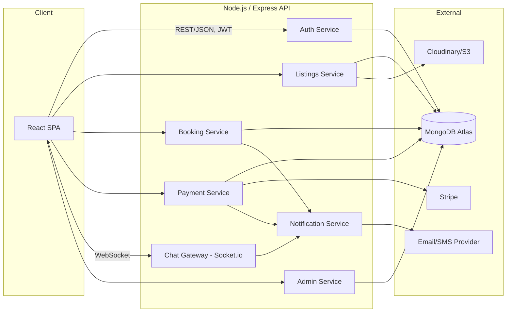

# Architecture Document
## Local Services Marketplace (MERN Stack)

**Last updated:** August 2026

---

## 1. Tech Stack

| Layer | Technology | Notes |
|---|---|---|
| Frontend | React (Vite), React Router, TanStack Query, Tailwind CSS | SPA, component-driven |
| Backend | Node.js, Express | REST API, layered structure |
| Database | MongoDB (Mongoose) | Document store, good fit for flexible listing schemas |
| Real-time | Socket.io | Chat + live booking/calendar updates |
| Auth | JWT (access + refresh tokens) + Google OAuth | Role-based access control |
| Payments | Stripe (Payment Intents + manual capture for escrow) | Test mode for portfolio/demo |
| File storage | Cloudinary or AWS S3 | Vendor photos, listing images, ID verification docs |
| Notifications | Nodemailer (email), optional Twilio (SMS) | Triggered via event system |
| Deployment | Frontend: Vercel — Backend: Render/Railway — DB: MongoDB Atlas | Free-tier friendly for a portfolio deploy |

## 2. High-Level System Diagram



## 3. Database Schema (MongoDB Collections)

### `users`
```js
{
  _id: ObjectId,
  name: String,
  email: String,          // unique
  passwordHash: String,   // null if OAuth-only
  googleId: String,       // optional
  role: "customer" | "vendor" | "admin",
  phone: String,
  avatarUrl: String,
  isVerified: Boolean,    // vendor verification status
  status: "active" | "suspended",
  createdAt: Date,
  updatedAt: Date
}
```

### `vendorProfiles`
```js
{
  _id: ObjectId,
  userId: ObjectId,        // ref users
  businessName: String,
  category: String,        // e.g. "Tutoring", "Photography"
  description: String,
  serviceArea: {
    city: String,
    coordinates: [lng, lat]   // geo index for radius search
  },
  verificationDocs: [String],  // S3/Cloudinary URLs
  avgRating: Number,        // denormalized for fast search sort
  reviewCount: Number,
  createdAt: Date
}
```

### `listings`
```js
{
  _id: ObjectId,
  vendorId: ObjectId,       // ref vendorProfiles
  title: String,
  description: String,
  category: String,
  price: Number,
  durationMinutes: Number,
  photos: [String],
  availabilityRules: {      // recurring weekly availability
    daysOfWeek: [Number],   // 0-6
    startTime: String,      // "09:00"
    endTime: String         // "17:00"
  },
  isActive: Boolean,
  createdAt: Date
}
```

### `bookings`
```js
{
  _id: ObjectId,
  listingId: ObjectId,
  customerId: ObjectId,
  vendorId: ObjectId,
  slot: {
    date: Date,
    startTime: String,
    endTime: String
  },
  status: "pending" | "accepted" | "declined" | "completed" | "cancelled" | "disputed",
  price: Number,
  paymentId: ObjectId,      // ref payments
  createdAt: Date,
  updatedAt: Date,
  statusHistory: [
    { status: String, changedAt: Date, changedBy: ObjectId }
  ]
}
```

### `payments`
```js
{
  _id: ObjectId,
  bookingId: ObjectId,
  stripePaymentIntentId: String,
  amount: Number,
  commissionAmount: Number,
  status: "held" | "released" | "refunded" | "disputed",
  heldAt: Date,
  releasedAt: Date
}
```

### `reviews`
```js
{
  _id: ObjectId,
  bookingId: ObjectId,     // ensures one review per completed booking
  customerId: ObjectId,
  vendorId: ObjectId,
  rating: Number,           // 1-5
  comment: String,
  vendorResponse: String,
  createdAt: Date
}
```

### `messages`
```js
{
  _id: ObjectId,
  bookingId: ObjectId,      // chat scoped to a booking
  senderId: ObjectId,
  text: String,
  readAt: Date,
  createdAt: Date
}
```

### `notifications`
```js
{
  _id: ObjectId,
  userId: ObjectId,
  type: String,             // "booking_request" | "payment_confirmed" | etc.
  payload: Object,
  isRead: Boolean,
  createdAt: Date
}
```

**Indexes to add:** `users.email` (unique), `vendorProfiles.serviceArea.coordinates` (2dsphere), `listings.category`, `bookings.status`, `bookings.slot.date`, `messages.bookingId`.

## 4. API Structure (REST)

```
/api/auth
  POST   /register
  POST   /login
  POST   /google
  POST   /refresh-token
  POST   /logout

/api/users
  GET    /me
  PATCH  /me

/api/vendors
  POST   /                     (create vendor profile)
  GET    /:id
  PATCH  /:id
  POST   /:id/verify           (admin only)

/api/listings
  GET    /                     (search/filter: category, price, rating, location, date)
  POST   /                     (vendor only)
  GET    /:id
  PATCH  /:id
  DELETE /:id
  GET    /:id/availability

/api/bookings
  POST   /                     (customer creates booking)
  GET    /me                   (as customer or vendor)
  PATCH  /:id/status           (accept/decline/complete/cancel)
  GET    /:id

/api/payments
  POST   /create-intent
  POST   /webhook               (Stripe webhook — capture/hold/release)
  POST   /:bookingId/release
  POST   /:bookingId/refund

/api/reviews
  POST   /
  GET    /vendor/:vendorId
  POST   /:id/response          (vendor responds)

/api/messages
  GET    /booking/:bookingId
  POST   /booking/:bookingId    (fallback REST; primary path is Socket.io)

/api/admin
  GET    /vendors/pending
  GET    /disputes
  PATCH  /disputes/:id
  GET    /analytics
```

## 5. Auth Flow

1. User registers → password hashed with bcrypt → JWT access token (short-lived, ~15 min) + refresh token (httpOnly cookie, ~7 days) issued.
2. Every protected route uses an Express middleware that verifies the access token and attaches `req.user`.
3. Role-based middleware (`requireRole("vendor")`, `requireRole("admin")`) guards route access.
4. Refresh endpoint rotates tokens using the httpOnly cookie so the access token never needs long-lived storage in localStorage.

## 6. Booking State Machine

```
pending → accepted → completed → (payment released)
pending → declined
accepted → cancelled → (payment refunded)
completed → disputed → (admin resolves → released or refunded)
```

All transitions are written through a single `updateBookingStatus()` service function that:
- Validates the transition is legal from the current state
- Writes to `statusHistory`
- Triggers the relevant notification + payment side-effect

## 7. Payment / Escrow Flow

1. Customer confirms booking → backend creates a Stripe **PaymentIntent** with `capture_method: manual`.
2. Stripe authorizes and holds the funds; `payments.status = "held"`.
3. On booking `completed` status + a configurable grace period (e.g., 24h with no dispute), a scheduled job (node-cron) captures the payment and marks it `released`, minus platform commission.
4. If a dispute is raised before capture, admin manually resolves — either captures (release to vendor) or cancels the PaymentIntent (refund to customer).

## 8. Real-Time Layer (Socket.io)

- Namespace per booking: `booking:{bookingId}` — customer and vendor join this room after a booking is accepted.
- Events: `message:send`, `message:receive`, `booking:statusUpdate` (pushes live status changes to both parties without a page refresh).
- Socket auth via JWT passed in the connection handshake, validated against the same middleware used for REST.

## 9. Folder Structure

```
/server
  /src
    /config          (db connection, env, stripe, cloudinary)
    /models           (Mongoose schemas)
    /routes
    /controllers
    /services         (business logic: bookingService, paymentService)
    /middleware        (auth, roleGuard, errorHandler)
    /sockets           (chat + booking real-time handlers)
    /jobs              (node-cron: payment release, reminder emails)
    /utils
  server.js

/client
  /src
    /pages             (route-level components)
    /components         (shared UI)
    /features           (auth, listings, bookings, chat, admin — colocated by domain)
    /hooks
    /api                (axios instances + query hooks)
    /context            (auth context)
    /utils
  main.jsx
```

## 10. Deployment Notes

- **Frontend:** Vercel, environment-based API URL.
- **Backend:** Render/Railway, with environment secrets for JWT, Stripe keys, Cloudinary keys.
- **Database:** MongoDB Atlas free tier (M0) is sufficient for a demo/portfolio deployment.
- **CI:** GitHub Actions running lint + tests on PR (mirrors the PR workflow you already use at 10Pearls — good talking point in interviews).
