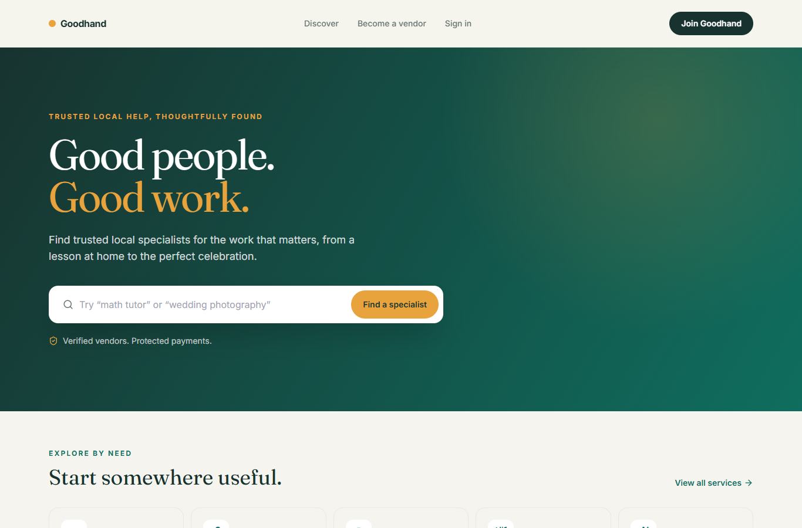
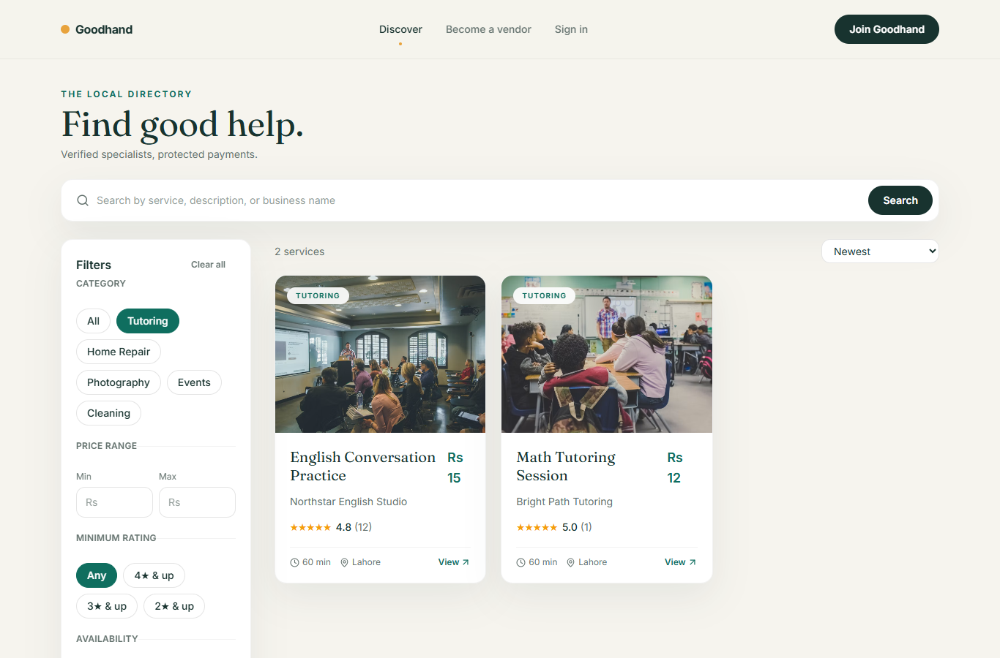
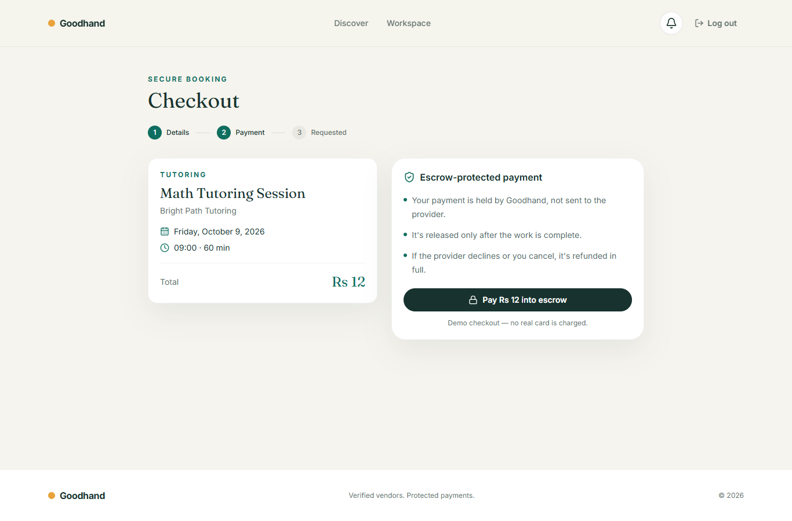
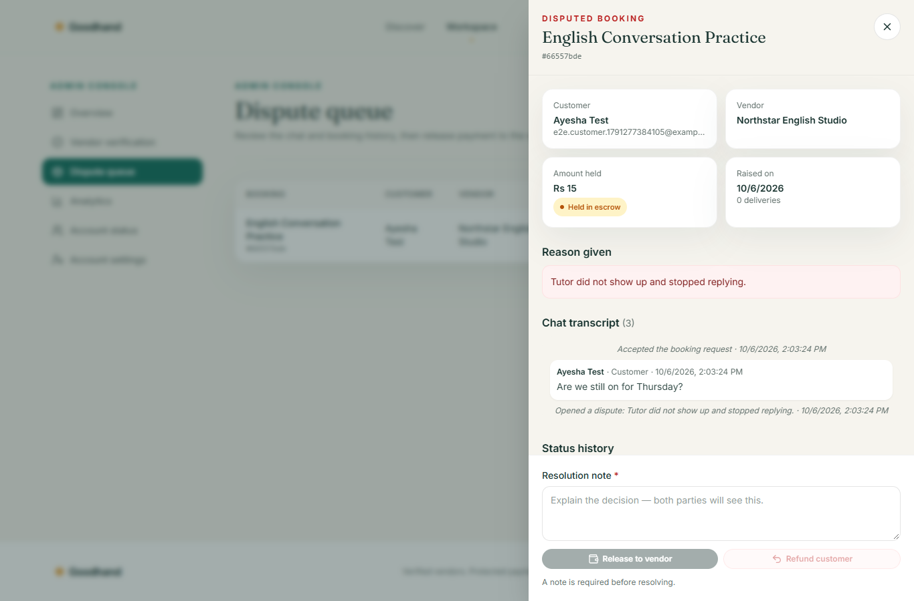
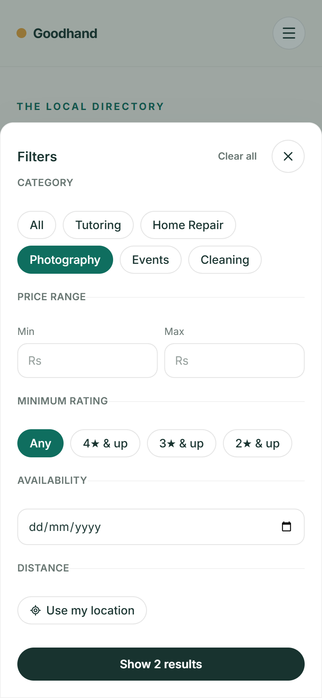

# Goodhand — Local Services Marketplace

**Find, book and pay trusted local service providers, with payments held in escrow until the job is done.**

Goodhand is a full-stack MERN marketplace that connects customers with local tutors, repair technicians, photographers, event planners and cleaners. It replaces the WhatsApp-group-and-word-of-mouth way of hiring with verified vendors, a real booking calendar, escrow-protected payments, chat tied to each booking, and reviews only from real customers.



## Screenshots

| Search with filters | Checkout into escrow |
|---|---|
|  |  |

| Admin dispute review | Mobile: filters drawer | Mobile: booking sheet |
|---|---|---|
|  |  |  |

## Features

**For customers**
- Search by text, category, price, rating, availability date and distance
- Book a slot from the provider's live availability; double-booking is prevented
- Give the service address, contact phone and job details at checkout, and get reminders 24 hours and 2 hours before
- Pay into escrow, then chat with the provider on that booking in real time
- Approve the delivered work, ask for a revision, or open a dispute
- Review the provider after a completed booking

**For vendors**
- Business profile with an admin verification step before listings go live
- Create and manage service listings with photos, prices and weekly availability
- Accept or decline requests, deliver work files, and track everything on a calendar
- Block days off (holidays, travel) so customers can't book them
- Earnings: money in escrow, awaiting payout and paid out, with payout details for bank (IBAN), JazzCash or Easypaisa; reply to reviews

**For admins**
- Review each vendor application (details, CNIC and documents) and approve it, or request specific corrections; the vendor is notified by email and resubmits
- Payouts: see what each vendor is owed and record transfers with a reference
- Suspend or reactivate accounts
- Dispute queue: read the full chat and booking history, then release the payment or refund it, with a required note
- Analytics: GMV, bookings by status, money held in escrow, commission, and recent transactions

**Across the app:** email verification, password reset, login rate-limiting and security headers; in-app and email notifications, a mobile-first responsive design, and accessible components (keyboard focus states, labelled controls, statuses never shown by colour alone).

## How escrow works

```
Customer pays ──► HELD in escrow
                   │
  vendor declines / either side cancels ──► REFUNDED
                   │
  work delivered ──► customer accepts (or auto-accepted after 3 days)
                   │
  24 h dispute window ──► RELEASED to vendor (minus platform commission)
                   │
  dispute raised ──► admin decides ──► RELEASED or REFUNDED
```

Every booking change goes through one state-machine function, which records who did what and when. Without Stripe keys the app runs in **demo payment mode** with the same lifecycle. With keys, it uses Stripe PaymentIntents with manual capture, so money is captured only on release.

## Tech stack

| Layer | Technologies |
|---|---|
| Frontend | React 18, Vite, React Router, TanStack Query, Tailwind CSS, Lucide icons |
| Backend | Node.js, Express, Socket.io, node-cron |
| Database | MongoDB with Mongoose |
| Auth | JWT access token + httpOnly refresh cookie, Google sign-in |
| Integrations | Stripe, Cloudinary, Nodemailer — all optional |
| Testing / CI | Vitest against a real MongoDB, GitHub Actions |

## Run it locally

Prerequisites: **Node.js 20+** and **MongoDB** running on `127.0.0.1:27017`.

```bash
npm install
cp server/.env.example .env            # set the two JWT secrets; everything else is optional
cp client/.env.example client/.env
npm run seed:demo                      # demo vendors, listings and test accounts
npm run dev                            # API on :5000, website on http://localhost:5173
```

### Test accounts

These exist after you run `npm run seed:demo` against a **local** database. On any remote database the seed refuses the public passwords and uses your `SEED_PASSWORD` instead (see DEPLOYMENT.md).

| Role | Email | Password |
|---|---|---|
| Admin | admin@example.com | Admin1234 |
| Customer | demo.customer@example.com | Demo1234 |
| Vendor (verified, has listings) | demo.tutor.math@example.com | Demo1234 |
| Vendor (awaiting approval) | demo.vendor.pending@example.com | Demo1234 |

The other nine demo vendors also use `Demo1234`; their emails are listed in `server/seedDemo.js`. To try every role at once, use a separate incognito window per account.

### Scripts

| Command | What it does |
|---|---|
| `npm run dev` | API + website with live reload |
| `npm test` | Server test suite (needs MongoDB; uses its own `lsm_test` database) |
| `npm run build --workspace=client` | Production build of the website |
| `npm run check:server` | Server syntax check |
| `npm run seed:demo` | Load demo data. Safe to re-run; set `MONGODB_URI` to target another database |

## Deploy

It runs on free tiers: MongoDB Atlas + Render (API) + Vercel (website). Step-by-step instructions are in **[DEPLOYMENT.md](DEPLOYMENT.md)**.

## Project structure

```
client/            React app (Vite)
  src/pages/       route-level screens (customer, vendor, admin)
  src/components/  shared UI: dashboard shell, chat, dispute drawer, ...
  src/api/         API calls
server/            Express API
  src/services/    business logic (booking state machine, payments, reviews)
  src/jobs/        hourly escrow release + auto-complete
  src/sockets/     real-time chat and booking updates
  tests/           Vitest suite
docs/screenshots/  images used in this README
```

The design documents are in the repo root: [PRD.md](PRD.md) (requirements), [Architecture.md](Architecture.md) (schemas, API and flows) and [Design.md](Design.md) (screens and visual system). [task.md](task.md) is the build log.

## Author

**Muhammad Farooq** — [@farooq831](https://github.com/farooq831)
